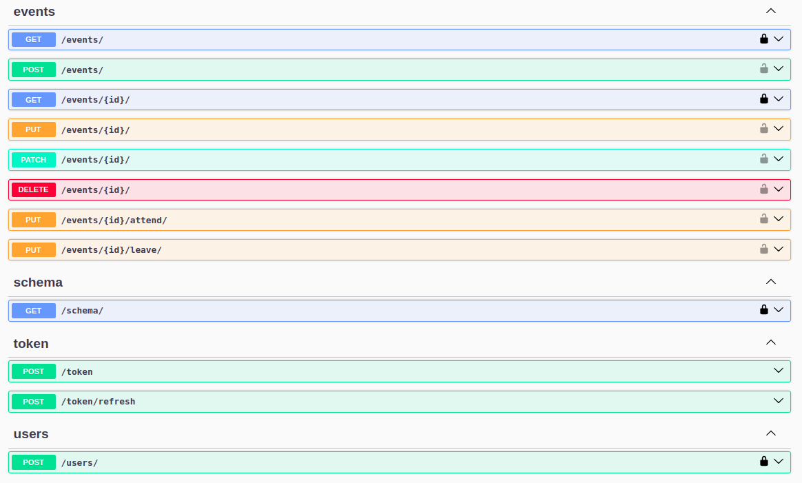

# Events Manager


 Events manager app allows users to create a personal account, log in, and create, edit, fetch, and register to attend events. 

## Table of Content
- Requirements
- Installation
- API Endpoints

## Requirements
- python-full >= 3.10
- djangorestframework = 3.15.2

## Installation

1. Once you've downloaded the current code using git, you need to follow the next steps to have the project fully installed and running on your PC.

   * Create a virtual environment (replace 'venv' with your preferred name)
    ```bash
    python -m venv venv
   ```

  * Activate the virtual environment based on your system 
    ```bash
    # For macOS/Linux
    source venv/bin/activate
    
     # For Windows
    venv\Scripts\activate
    ```
  * Install all necessary requirements
    ```bash
    pip install -r requirements.txt
    ```
  * Apply all existing migrations for the database
    ``` bash 
    python src/manage.py migrate
    ```
  * Now you're ready to run the server 
    ```bash
    python manage.py runserver
    ```
2. To make sure the application is functioning correctly check it with tests:
    ``` bash
     pytest
    ```

3. Before commiting a new code, make sure it's meets pre-commit requirements with the following command:
    ```bash
    pre-commit run --all-files
    ```
   
## API Endpoints

* All API Endpoints are represented in swagger which you can check right in it. To get access it you are to do the 
  following:
    ```bash
    python manage.py runserver
    ```
    and in your browser navigate to http://127.0.0.1:8000/swagger/


